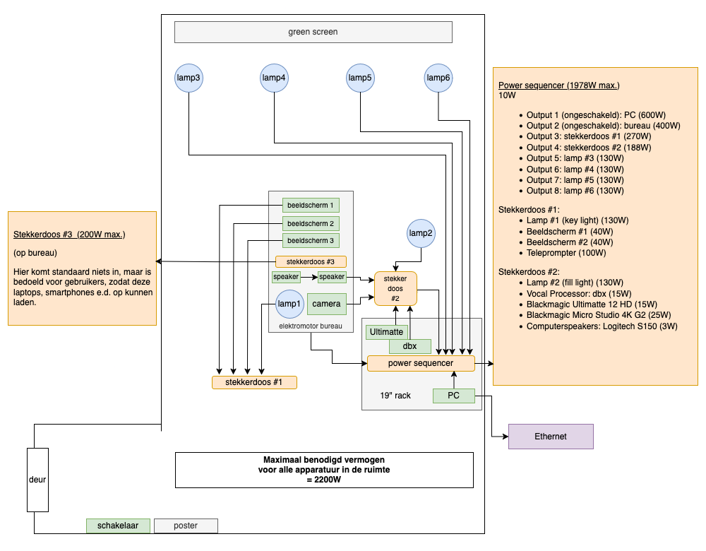

**Power strip #1 — 270 W maximum**

- Light #1, key light: 130 W
- Monitor #1: 40 W
- Monitor #2: 40 W
- Monitor #3, teleprompter: 100 W

**Power strip #2 — 188 W maximum**

- Light #2, fill light: 130 W
- Blackmagic camera: 25 W
- Speakers: 3 W
- Blackmagic Ultimatte 12 HD hardware keyer: 15 W
- dbx vocal processor: 15 W

**Power strip #3, on the desk — 200 W maximum**

Nothing is connected to this by default. It is intended for visitors to charge laptops, smartphones and similar devices.

**Power sequencer — 2,050 W maximum**

- Output 1, unswitched: PC, 600 W
- Output 2, unswitched: desk, 400 W
- Output 3: power strip #1
- Output 4: power strip #2
- Output 5: light #3, green screen left, 130 W
- Output 6: light #4, green screen bottom left, 130 W
- Output 7: light #5, green screen bottom right, 130 W
- Output 8: light #6, green screen right, 130 W

### Network requirements

One Ethernet connection of at least 1 Gbit/s is required.
