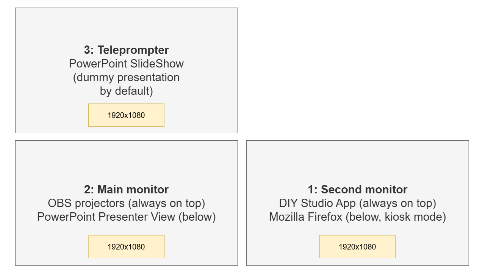

All displays use a resolution of 1920×1080.

**1 — OBS projectors and PowerPoint Presenter View.** This display is configured as the main display in Windows so that Presenter View appears here automatically.

Connect it to the PC with a DisplayPort cable.

**2 — DIY Studio App and Firefox.** This is the only display the user can interact with. By default, the mouse pointer cannot leave it.

Connect it to the PC with a DisplayPort cable.

**3 — Teleprompter.** This is used only for the PowerPoint slide show.

Connect it to the PC with an HDMI cable. Set the colours slightly warmer and reduce the brightness because this screen effectively acts as an additional light on the user's face.
