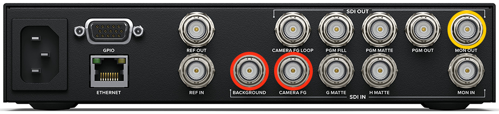

- Connect the left-hand DeckLink port to `BACKGROUND` on the Ultimatte with a BNC cable, shown in red.
- Connect the right-hand DeckLink port to `MON OUT` on the Ultimatte with a BNC cable, shown in yellow.
- Connect the camera to `CAMERA FG` on the Ultimatte with the Blackmagic Micro BNC cable, shown in red.
- Install the corresponding Blackmagic Ultimatte software.
- Connect the Ultimatte to the PC's second network port with an Ethernet cable.
- Configure Windows to use a static IP address for this network adaptor; see the next chapter.

The Ultimatte Software Control interface consists of:

1. Main tabs.
2. Groups, which function as sub-tabs.
3. Settings belonging to a main tab or group.
4. Functions: tasks that can be run and settings that can be switched on or off.
5. Monitor Output: select one of these six options to determine what is sent through the `MON OUT` SDI output and received by OBS.

Watch the instructional video at <https://www.youtube.com/watch?v=CStZ01zP4bQ>.

Create a key as follows; these instructions still need updating:

1. On the hardware front panel, press the preset you want to change: 1, 2 or 3.
2. In the software, open the main *MATTE* tab and click the reset icon, the arrow in a circle, to create an automatic key.
3. Open the *Screen Sample* group. Click *Dual Cursor*, then *Wall Cursor Position*. Move the cursor shown on the output using *Cursor Position Horizontal* on the left and *Vertical* on the right.
4. Click *Sample Wall*.
5. Click *Floor Cursor Position* and move it elsewhere, avoiding areas with more shadow because their colour may differ.
6. Click *Sample Floor*.
7. Open the *Clean Up* group and set *Clean Up Level* to **10%**.
8. Open the *Veil* group and reduce *Master Veil*, at the bottom left, to between **−6%** and **−15%**. Preferably do not reduce it further.
9. Return to the main *MATTE* group and adjust the *Black Gloss* dial.
10. Open the main *FOREGROUND* tab and the *Black/White Level* group. Set *Black Level Master*, bottom left, to **−25** and *White Level Master*, bottom right, to **115**.
11. Open *Contrast/Saturation*. Set *FG Saturation Master*, on the right, to **100** and *FG Contrast Master* to **5%**.
12. Open *Quick Preset* at the top of the menu bar and choose *save 1/2/3*, depending on the preset you want to overwrite.
