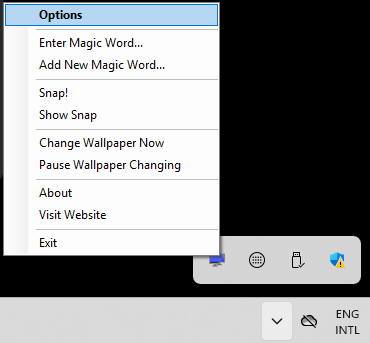
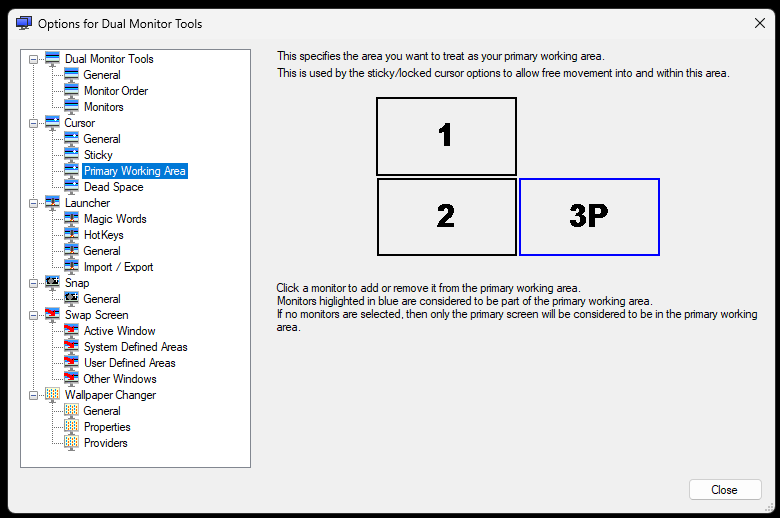

This application prevents the mouse pointer from leaving the main display. Right-click its system-tray icon and select *Options*:

Change the following settings under `Cursor > Sticky`:

Open `Cursor > Primary Working Area` and select 3P, at the bottom right:

**Important:** finally, activate the sticky cursor with `Ctrl+comma`.
