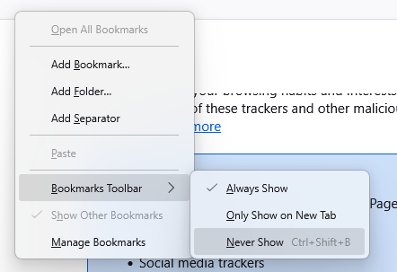

Firefox always runs behind the DIY Studio App window. It is used to sign in to Microsoft, play videos in a video player, including tutorial videos and user recordings, and display the DIY Studio App loading screen.

- Sign in as **User** and start the Firefox installer. When prompted for the administrator password, click `"No"`.
- Start Firefox and set it as the default browser. Windows Settings will open; beside `Make Firefox your default browser`, click `Set default`.
- Configure Firefox as follows:
  - Enter `about:config` in the address bar.
  - Accept the security warning.
  - Enter `disableResetPrompt`, click the plus icon to add it and ensure `boolean` is selected.
  - Find `browser.link.open_newwindow.restriction` and double-click it to change the value to `0`.
  - Find `browser.link.open_newwindow` and double-click it to change the value to `1`.
- Then:
  - Open the hamburger menu at the top right.
  - Select *Settings*.
  - Under *General*, click `Make default`, then `Set default` in Windows Settings if this has not already been done.
  - Open `Privacy & Security`.
  - Under *Passwords*, clear `Ask to save passwords`.
  - Under *History*, set `Firefox will` to `Never remember history`.
  - Restart Firefox.
  - Right-click the bookmarks toolbar and select `Bookmarks Toolbar > Never Show`.

