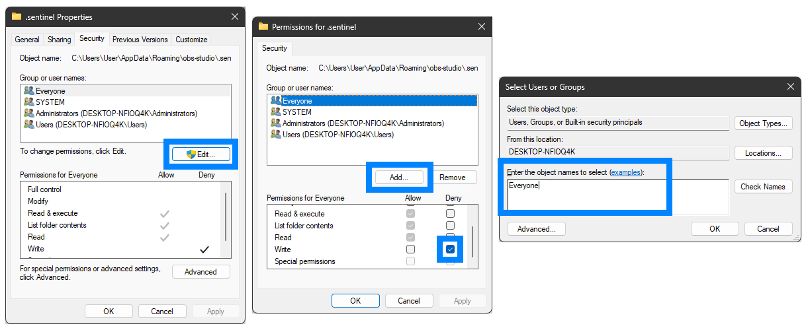

OBS, Open Broadcaster Software, is the underlying recording software used by the DIY Studios. It always starts minimised, so its interface is not normally visible.

OBS must always run in **Portable Mode**. This stores all OBS settings, profiles and scene collections in its installation folder. It prevents each Windows user from receiving separate settings and prevents visitors from changing them. Portable Mode is activated by starting the application with the `--portable` argument. `DIY-studio-app-startup-script.bat` does this automatically at sign-in. To change settings, start OBS in Portable Mode as administrator.

- Create a taskbar shortcut containing:

  ```text
  ../obs64.exe --portable
  ```

- Start OBS once by right-clicking this taskbar icon and selecting `Run as Administrator`. Repeat this after every update so that the correct configuration folders are created.
- Always start OBS as administrator when changing its configuration. While signed in with the **Setup** administrator account, open the interface by clicking the OBS icon in the Windows system tray.
- Select `Profile > Import` from the top menu and import the latest profile from the DIY Studio Software Package. Then select it from the *Profile* menu.
- Select `Scene Collection > Import` and import the latest scene collection from the package. Then select it from the *Scene Collection* menu. If asked whether OBS should automatically search for collections, select `"No"`. Relink the required files in `C:\Software\obs-assets\`.
- Enable **Studio Mode** under **Controls** at the bottom right.
- Ensure `Transition Type`, below *Quick Transitions*, is set to `Cut`, not `Fade`.
- Clear every option in the three-dot menu to the right of *Transition*.
- Under `File > Settings`:
  - *General*: clear `Automatically check for updates on startup`.
  - *Advanced*: set `Process Priority` to `High`.

The remaining settings should match this screenshot:


- Open `Tools > WebSocket Server Settings`. Set `Server Password` to the same password used in `C:\Software\Mediaproducties-DIY-Studio-App\config\config.cfg`. Select `"Yes"` when asked whether to use your own password.
- Select `Enable WebSocket server`.
- Windows Security may ask whether public and private networks may access the app. Select `Cancel`.
- Open `Tools > Decklink Output` and use:
  - *Device*: `DeckLink Studio 4K`
  - *Mode*: `1080p25`
  - Select `Auto start on launch`.
  - Click `Start`.


- *(Possibly unnecessary)* Open `C:\Users\User\AppData\Roaming\obs-studio`, right-click `.sentinel`, select *Properties* and open *Security*. Click *Edit*, *Add*, enter `Everyone` and select `Deny: Write`. If the folder does not exist, create it first.


