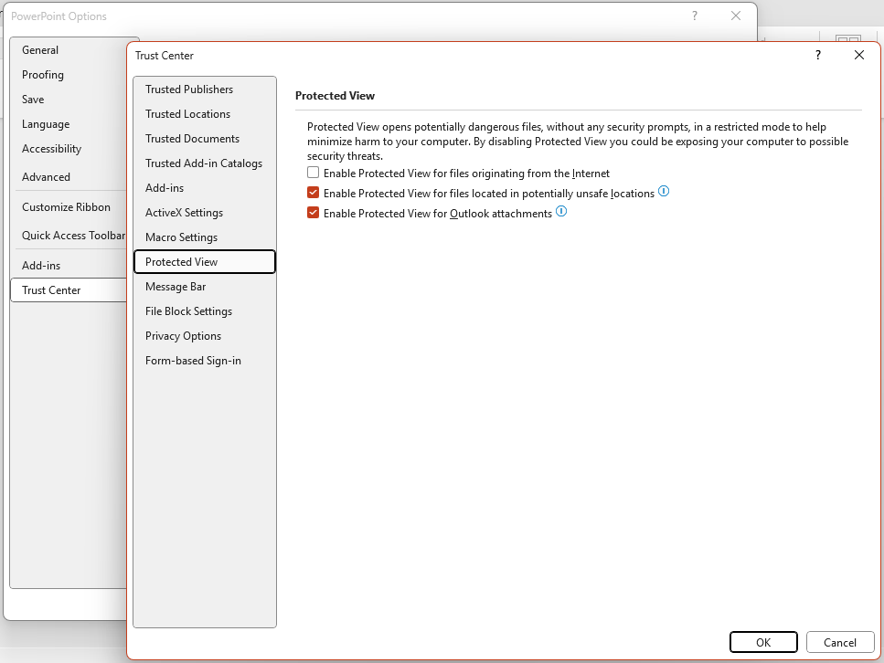

Sign in as **User** and start PowerPoint to change these settings.

- Office is installed automatically with Windows. Open PowerPoint and follow the activation instructions. Select `Sign in or create account`. Content & Digital holds the account details.
- When asked whether to use the account throughout the computer, `Use this account everywhere on your device`, do **not** accept. Select `Microsoft apps only`.
- Select `Don't send optional data`. Then open `File > Account > Account Privacy` and clear every privacy option.

- Open `C:\Assets\v1\default_presentation.pptx` and configure:
  - `Slide Show > Use Presenter View` must be **selected**.
  - `Slide Show > Monitor` must be set to `Monitor 3 AAA`.
  - Under `File > Options > Trust Center > Trust Center Settings… > Protected View`, clear:
    - `Enable Protected View for files originating from the Internet`

