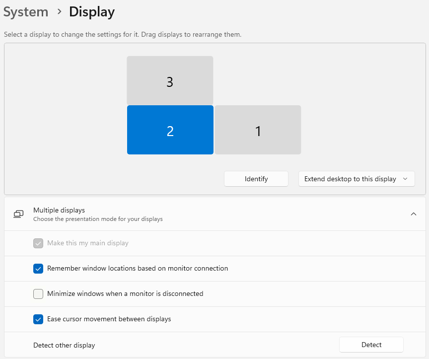
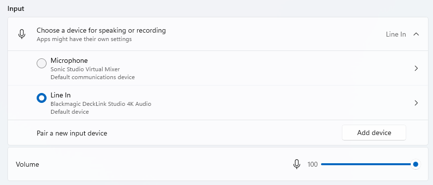

The PC runs Windows 11 Professional. Perform a clean installation without UU software. This can be done with a network reset: during startup, repeatedly press `F11` as soon as the HP logo appears to start network recovery.

## Step 1: configure user accounts

Windows must have two user accounts:

- A password-protected local administrator account named **Setup**.
- A password-protected local standard account named **User**. After installation, add it through `Settings > Accounts > Other Users > Add account`.

Disconnect the PC from the internet while configuring Windows. When prompted to connect to a network, press `Shift+F10` and run:

```bat
OOBE\BYPASSNRO
```

This contains the letter **O**, not the digit **0**. After restarting, select `I don't have internet`.

> Update: Microsoft has now blocked this workaround. If no other local-account option is available, temporarily use Arthur Verbeek's Microsoft account and create a local account afterwards. Then remove the Microsoft account.

Choose `"No"` for all other installation questions and `Required Only` for diagnostics.

## Step 2: sign in as User by default

- Sign in as **Setup**.
- Press `Win + R`, enter `regedit` and start Registry Editor.
- Change the following registry entry from `2` to `0`:

  ```text
  HKEY_LOCAL_MACHINE\SOFTWARE\Microsoft\Windows NT\CurrentVersion\PasswordLess\Device\DevicePasswordLessBuildVersion
  ```


- Restart the computer and sign in as **Setup** again.
- Press `Win + R` and run `netplwiz`.
- Clear `Users must enter a user name and password to use this computer`.
- Click `OK`, enter `User` as the user name, enter the chosen password and press Enter.

If this is unavailable, disable Windows Hello.


## Step 3: system settings

- Under `Settings > System > Display > Multiple displays`:
  - Select `Remember window locations based on monitor connection`.
  - Clear `Minimize windows when a monitor is disconnected`.
  - Select the lower-left display, display 2, and enable `Make this my main display`.



- Under `Settings > System > Power > Screen, sleep & hibernate timeouts`:
  - `Turn off screen after: Never`
  - `Make my device sleep after: Never`
  - `Make my device hibernate after: Never`
- Under `Settings > Privacy & security > Notifications`, switch off `Let apps access your notifications`.
- *(Probably unnecessary)* Under `Apps > Startup`, switch `HP Notifications` and `myHP System Tray` off.

## Step 4: Ultimatte network settings

Open `Settings > Network & internet > Ethernet` and select the lower port, `Ethernet 2`, not `soliscom.uu.nl`. Then open `IP assignment > Edit > Manual > IPv4` and use:

```text
IP address: 192.168.10.221
Subnet mask: 255.255.255.0
```

This IP address must differ from the Ultimatte's address. Switch Wi-Fi off if present.

## Step 5: select the correct microphone input

Sign in as **User**, open `Settings > System > Sound` and select:

- Input
  - Choose a device for speaking or recording
    - Line In
    - Blackmagic DeckLink Studio 4K Audio
  - Volume: 100



Ensure the microphone icon beside *Volume* is not crossed out, which indicates that the microphone is muted.

## Step 6: disable “Let's finish setting up your device”

1. Open `Settings > Notifications` and switch *Notifications* fully off.

   

   

2. Open *Additional settings* and clear all options.

   
