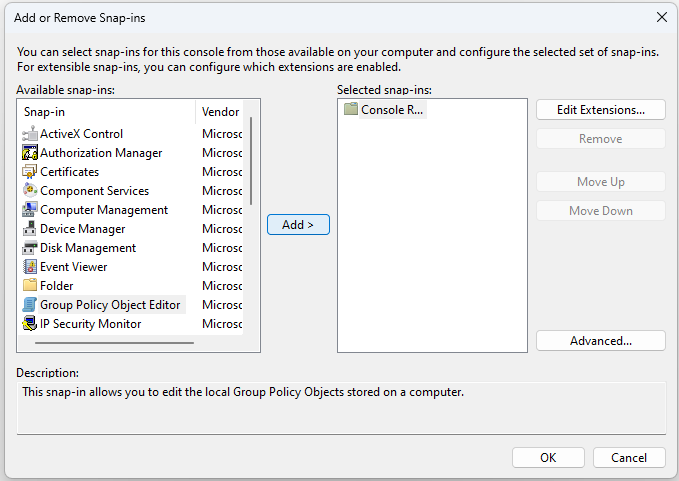

## Local Group Policy for User

A Local Group Policy prevents studio users from seeing the taskbar, File Explorer, Start menu and other Windows components, and from starting arbitrary applications.

1. Sign in as **Setup**, the administrator account.
2. Press `Win + R`, enter `mmc` and press Enter.
3. Select `File > Add / Remove Snap-in`.

   

4. Select `Group Policy Object Editor` in the left-hand panel and click `Add`.

   

5. Click `Browse`.

   

6. Open the *Users* tab.
7. Select **User**.

   

8. Click `OK`, `Finish` and then `OK` again.

Change the following settings under:

```text
Console Root > Local Computer\User Policy\User Configuration\Administrative Templates\
```


- `System > Custom User Interface` → **Enabled**

  Under *Options > Interface file name*, enter:

  ```text
  C:\Software\DIY-studio-startup-script.bat
  ```

- `System > Ctrl + Alt + Del Options > Remove Change Password` → **Enabled**
- `System > Ctrl + Alt + Del Options > Remove Task Manager` → **Enabled**
- `System > Removable Storage Access > All Removable Storage classes: Deny all access` → **Enabled**
- `Windows Components > AutoPlay Policies > Turn off Autoplay` → **Enabled**

Select `File > Save` and save the policy.

You can always sign out with `Ctrl + Alt + Del` to sign in using the **Setup** account.


