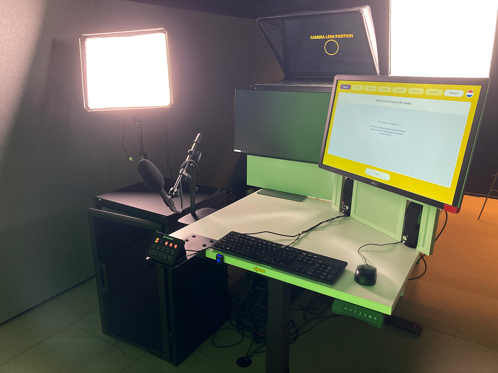

# Presenter DIY-studio

## Zelfstandig video's opnemen

De Presenter DIY-studio is een opnamestudio waarin bezoekers zelfstandig professionele video’s kunnen maken ter versterking van onderwijs en (wetenschaps)communicatie. De bezoeker doet alles zelf, inclusief opstarten en afsluiten, en wordt gedurende het hele proces begeleid door middel van een uitlegvideo, instructieposters en een applicatie op de computer die de gebruiker meeneemt langs alle stappen. Na een opname kan deze worden teruggekeken, en indien goedgekeurd, zorgt de koppeling met OneDrive ervoor dat video's direct in de cloud komen te staan. Er kan worden opgenomen met een foto of egale kleur als achtergrond of met een PowerPointpresentatie op de achtergrond. Desgewenst wordt de presentatietekst op een scherm voor de camera weergegeven, zodat er kan worden meegelezen.

Het project is open source: van de handleiding, technische tekeningen en benodigde assets tot de applicatie en benodigde plugins. Op gebied van software zijn enkele componenten níet open source: Microsoft Windows, SharePoint/OneDrive, PowerPoint, Blackmagic Desktop Video, Blackmagic Ultimatte Software Control en de Stream Deck applicatie.

Het project bestaat uit de volgende GitHub-repositories:

* [Hoofdrepository met handleidingen en assets](https://github.com/UtrechtUniversity/presenter-diy-studio)
* [DIY Studio App](https://github.com/UtrechtUniversity/diy-studio-app)

## Handleiding downloaden

[Download de volledige handleiding als PDF](pdf/Presenter-DIY-studio-handleiding-nl.pdf)

## Copyright en licentie

De documentatie en media behorende bij dit project zijn gelicentieerd onder CC BY-SA 4.0. Lees hier [de volledige licentietekst](https://creativecommons.org/licenses/by-sa/4.0/).

Alle broncode en assets zijn gelicentieerd onder de EUPL v1.2, met uitzondering
van fonts en logo's.

## Vragen?

Maintainer: Wouter Verwijlen - w.j.verwijlen@uu.nl