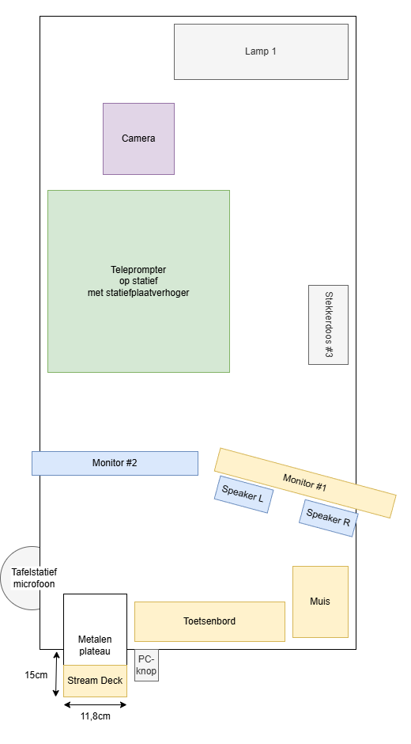

Het metalen plateau, de lamp en het camerastatief worden direct aan het
bureau vastgeschroeft.

Stekkerdoos #3 is voor gebruikers om telefoons en laptops te kunnen opladen.
Deze wordt met stevige dubbelzijdige tape vastgezet. In de huidige studio
zit deze aan een aparte tafel vast.

De Stream Deck krijgt een magneetsticker aan de onderkant, zodat deze
aan het metalen plateau vastkleeft, maar ook losgehaald kan worden.
