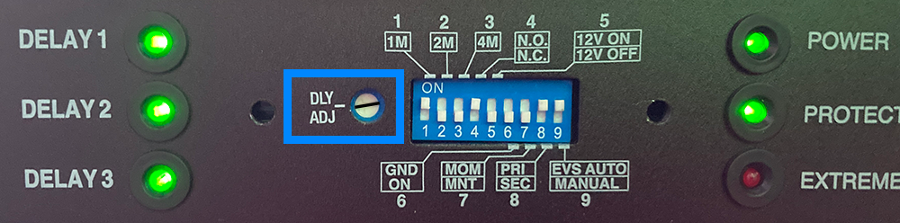

Verwijder de plaat met de “F” en verlaag de Delay Adjustment door met
een schroevendraaier (platte kop) de potentiometer bij *DLY ADJ* naar
**links** te draaien, zodat deze tussen 8 en 9 uur staat. Dit verkleint
de tijd tussen het in- en uitschakelen van de drie groepen van 30
seconden (de standaardinstelling) naar ongeveer 5 seconden.

