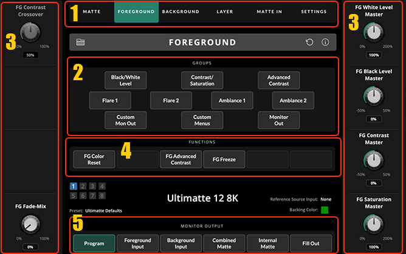

- Verbindt de linkerpoort van de Decklink met een BNC-kabel met
  BACKGROUND op de Ultimatte (rood).

- Verbindt de rechterpoort van de Decklink met een BNC-kabel met de MON
  OUT op de Ultimatte (geel).

- Verbindt de camera met de Blackmagic Micro-BNC-kabel met CAMERA FG op
  de Ultimatte (rood).

- Installeer vervolgens de bijbehorende Ultimatte software van
  Blackmagic.

- Sluit de Ultimatte aan met ethernetkabel aan de tweede netwerkpoort
  van de PC.

- Stel Windows zo in dat het voor deze netwerkadapter een statisch
  IP-adres gebruikt (zie volgende hoofdstuk).

De interface van Ultimatte Software Control bestaat uit de volgende
delen:

1.  Hoofdtabbladen

2.  Groups: dit zijn een soort van subtabbladen

3.  Instellingen die horen bij een hoofdtabblad of group

4.  Functions: taken die je kunt laten uitvoeren en settings die je aan
    en uit kunt zetten

5.  Monitor Output: één van deze 6 opties kan worden geselecteerd, en
    dit is dan hetgeen dat wordt uitgestuurd over de MON OUT SDI output.
    Dit is wat OBS binnenkrijgt.

Bekijk de instructievideo op:
<https://www.youtube.com/watch?v=CStZ01zP4bQ>

Een key maak je als volgt (updaten):

1.  Klik op het front panel van de hardware op de preset die je wil
    veranderen (1, 2 of 3)

2.  In de software: ga naar hoofdtabblad *MATTE* en klik op het
    reset-icoon (de pijl in een cirkelvorm) om een automatische key te
    laten maken.

3.  Klik op de group *Screen Sample*, klik op de function *Dual Cursor*,
    dan op de function *Wall Cursor Position* en verplaats de cursor die
    je nu ziet verschijnen op de output met *Cursor Position Horizontal*
    (links) en *Vertical* (rechts)

4.  Klik op de functie *Sample Wall*

5.  Klik op de functie *Floor Cursor Position* en zet deze elders (maar
    niet in een gebied met meer schaduw, aangezien de kleur daarvan kan
    afwijken)

6.  Klik op de functie *Sample Floor*

7.  Ga naar group *Clean up* en zet *Clean Up Level* op **10%**

8.  Ga naar group *Veil* en zet *Master Veil* (linksonder) iets terug:
    tussen **-6%** en **-15%**, liever niet meer dan dat.

9.  Ga naar hoofdgroep *MATTE* en draai aan de *Black Gloss* dial.

10. Ga naar hoofdtabblad *FOREGROUND*, group *Black/White Level*. Zet
    *Black Level Master* (linksonder) op **-25** en *White Level Master*
    (rechtsonder) op **115**

11. Ga naar group *Contrast/Saturation* en zet *FG Saturation Master*
    (rechts) op **100** en *FG Contrast Master* op **5%**.

12. Ga naar het menu *Quick Preset* (helemaal bovenaan in de menubalk)
    en kies:  
    *save 1/2/3* (afhankelijk van welke preset je wil overschrijven)
