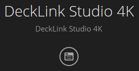
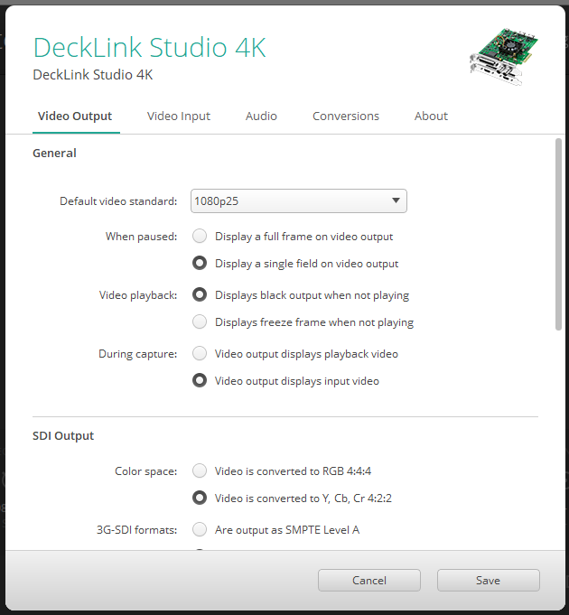

Dit softwarepakket bevat de drivers en configuratie-app die nodig zijn om de Decklink correct te laten functioneren. De app dient als volgt te worden ingesteld, door te klikken op het ronde icoon:

En vervolgens:

- `Default video standard: 1080p25`
- `Video playback: Displays black output when not playing`

