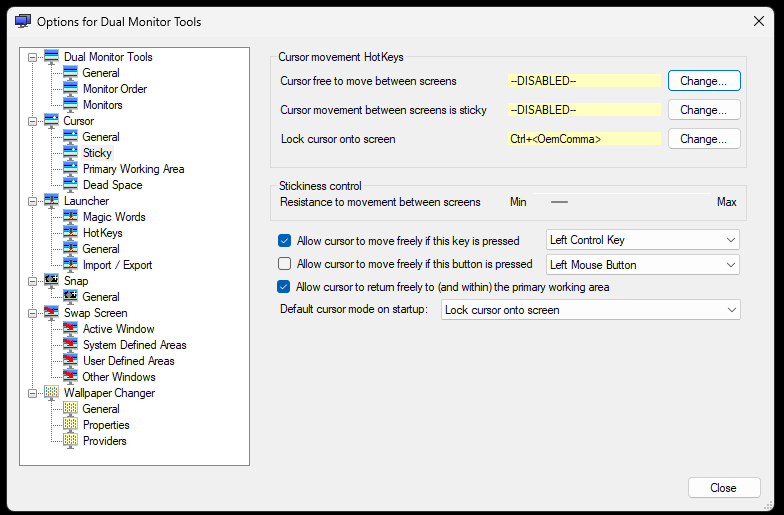

Deze app zorgt ervoor dat de muiscursor het hoofdscherm niet kan verlaten. Pas de instellingen aan door met de rechtermuisknop op het icoon in de System Tray te klikken en voor *Options* te kiezen:

Pas de volgende instellingen aan onder `Cursor > Sticky`:

Ga naar `Cursor > Primary Working Area` en selecteer 3P (rechtsonder):

**Belangrijk:** activeer tot slot de sticky cursor met `Ctrl+komma`!
