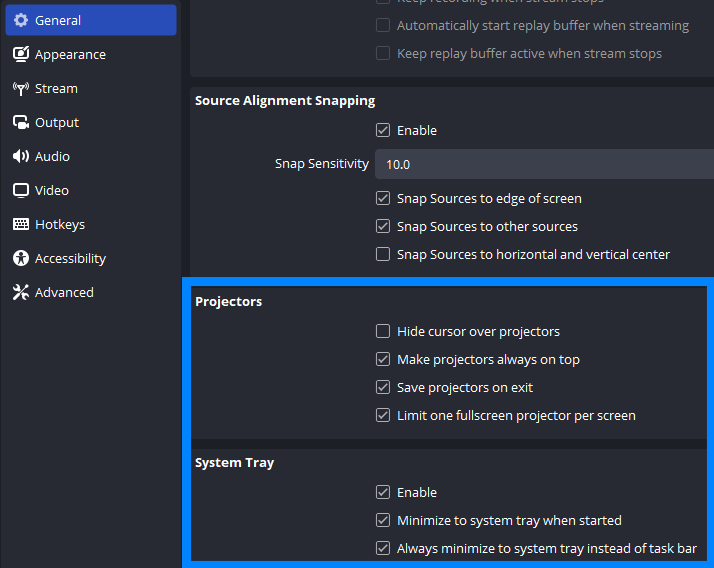
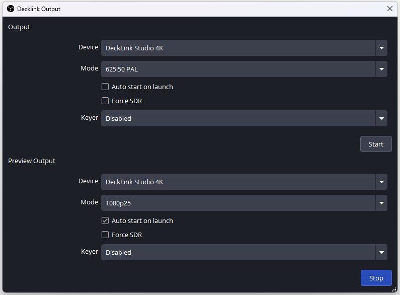

OBS (Open Broadcaster Software) is de onderliggende opnamesoftware van de DIY-studio's. OBS wordt altijd opgestart in minimized modus, waardoor de interface niet te zien is.

OBS dient altijd te draaien in **Portable Mode**. Dit zorgt ervoor dat alle instellingen van OBS (Profiles en Scene Collections) worden opgeslagen in dezelfde map waar het programma is geïnstalleerd. Dit voorkomt dat elke gebruiker zijn eigen OBS-settings heeft en voorkomt ook dat een gebruiker de instellingen kan wijzigen. Portable Mode wordt geactiveerd doordat de app gestart wordt met `--portable` als argument. Dit gebeurt automatisch bij het inloggen door `DIY-studio-app-startup-script.bat`, maar om settings te wijzigen dient OBS in portable mode als administrator te worden opgestart.

- Maak daarom een icoon op de taakbalk waarin het volgende staat:
  
  ```
  ../obs64.exe --portable
  ```

- Start OBS eerst één keer op door met de rechtermuisknop op dit icoon op de taakbalk te klikken en `Run as Administrator` te kiezen. Doe dit ook na elke update. Dit zorgt ervoor dat de juiste mappen voor de configuratie worden aangemaakt.

- Start OBS ook altijd als administrator als je een wijziging aan de configuratie wilt maken. De interface van OBS kan worden getoond door, wanneer ingelogd in Windows met het Setup-administratoraccount, op het OBS-icoon in de system tray van Windows te klikken.

- Kies in het topmenu `Profile > Import` en importeer het nieuwste profiel uit de DIY Studio Software Package. Selecteer dit vervolgens in het *Profile*-menu.

- Kies in het topmenu `Scene Collection > Import` en importeer de nieuwste scene collection uit de DIY Studio Software Package. Selecteer deze vervolgens in het *Scene Collection*-menu. Als je de vraag krijgt of OBS automatisch naar collections moet zoeken, kies dan `"No"`. Relink de benodigde bestanden. De staan in `C:\Software\obs-assets\`.

- Activeer **Studio Mode** rechtsonder bij **Controls**.

- Controleer of `Transition Type` (het dropdownmenu onder *Quick Transitions*) op `Cut` staat en niet op `Fade`.

- Bij het menu met de drie stippen rechts van *Transition* dienen alle opties uitgevinkt te zijn.

- Kies `File > Settings` en pas de volgende instellingen aan:
  
  - *General*: vink `Automatically check for updates on startup` uit.
  - *Advanced*: zet `Process Priority` op `High`.

De volgende settings horen er ook zo uit te zien:



- Kies `Tools > WebSocket Server Settings` en vul bij `Server Password` hetzelfde wachtwoord in als in `C:\Software\Mediaproducties-DIY-Studio-App\config\config.cfg` staat. Kies `"Yes"` bij de vraag of je daadwerkelijk je eigen wachtwoord wilt gebruiken.

- Vink `Enable WebSocket server` aan.

- Er kan een popup van Windows Security verschijnen met de vraag of public en private networks toegang mogen krijgen tot deze app. Kies `Cancel`.

- Kies `Tools > Decklink Output` en gebruik de volgende settings:
  
  - *Device*: `DeckLink Studio 4K`
  - *Mode*: `1080p25`
  - Vink `Auto start on launch` aan.
  - Klik op `Start`.



- *(Wellicht niet nodig)* Ga tot slot naar `C:\Users\User\AppData\Roaming\obs-studio`, klik met de rechtermuisknop op de map `.sentinel`, kies *Properties* en ga naar het tabblad *Security*. Klik op *Edit*, *Add*, type `Everyone`, en zet een vinkje bij `Deny: Write`. Als deze map niet bestaat, maak deze dan eerst aan.


