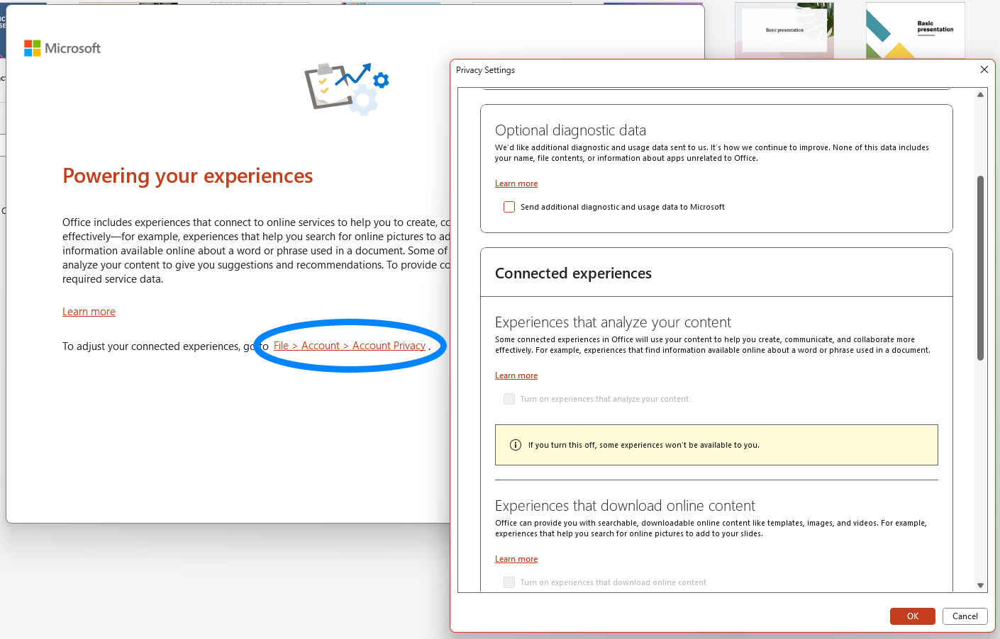

Log in als **User** en start PowerPoint om deze settings aan te passen.

- Office wordt automatisch geïnstalleerd met Windows. Open PowerPoint en volg de aanwijzingen om deze te activeren. Kies `Sign in or create account`. De accountgegevens zijn bekend bij Content & Digital.
- Bij het inloggen volgt de vraag of je op de hele computer wilt inloggen met dit account (`Use this account everywhere on your device`). Doe dit **niet** en kies `Microsoft apps only`.
- Kies `Don't send optional data`, en ga daarna naar `File > Account > Account Privacy` om de privacy-instellingen aan te passen. Vink daar alles uit.

- Open `C:\Assets\v1\default_presentation.pptx` en pas de volgende settings aan:
  - `Slide Show > Use Presenter View` moet **aangevinkt** zijn.
  - `Slide Show > Monitor` moet op `Monitor 3 AAA` staan.
  - De volgende optie moet **uitgevinkt** zijn onder `File > Options > Trust Center > Trust Center Settings… > Protected View`:
    - `Enable Protected View for files originating from the Internet`

