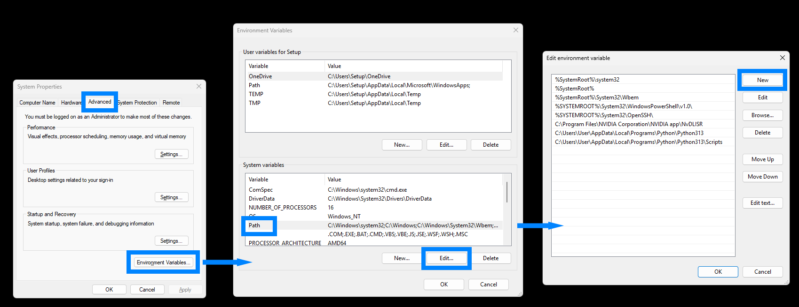

- Log in als **User** (niet **Setup**). Installeer Python zonder admin-rechten met de standaardinstellingen in:

  ```
  C:\Users\User\AppData\Local\Programs\Python\Python313
  ```

  Klik daarbij op `Install Now`.

- Kies aan het einde voor `Disable path length limit` om de `MAX_PATH`-limiet op te heffen.

- Voeg de volgende twee directories toe aan de system `PATH`-variabele:

  ```
  C:\Users\User\AppData\Local\Programs\Python\Python313
  C:\Users\User\AppData\Local\Programs\Python\Python313\Scripts
  ```

  Dit doe je als volgt:
  - Rechtermuisknop op het Windows-logo op de taakbalk.
  - Kies *System*.
  - Kies `Advanced system settings`.
  - Kies `Environment Variables`.
  - Ga naar `System variables`.
  - Selecteer `Path`.
  - Klik op `Edit... > New`.
  - Voeg eerst de eerste directory toe, klik daarna nogmaals op `New` en voeg de tweede directory toe.
  - Klik op `OK`.


