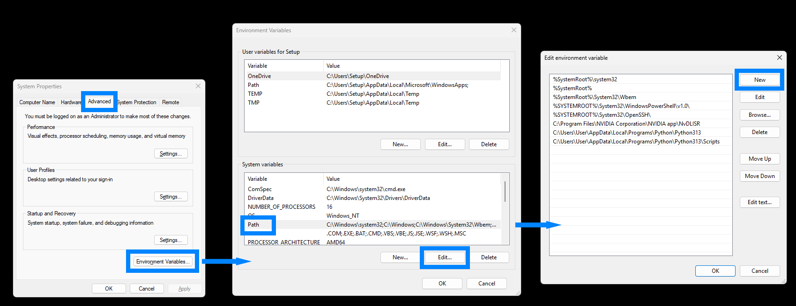

## Python 3.14

- Log in als **User** (niet **Setup**).

- Open de **Microsoft Store**. Als de Windows gebruikersinterface is uitgeschakeld: open Task Manager, kies `Run new task` en typ dan `ms-windows-store://home`.

- Installeer **Python Install Manager**.

- Als er gevraagd wordt om `LongPathsEnabled` op `1` te zetten, doe dit dan en bevestig met het administratorwachtwoord.

- Voeg de volgende drie directories toe aan de system `PATH`-variabele:
  
  ```
    C:\Users\User\AppData\Local\Python\bin\
    C:\Users\User\AppData\Local\Python\pythoncore-3.14-64\
    C:\Users\User\AppData\Local\Python\pythoncore-3.14-64\Scripts
  ```
  
  Dit doe je als volgt:
  
  - Rechtermuisknop op het Windows-logo op de taakbalk.
  - Kies *System*.
  - Kies `Advanced system settings`.
  - Kies `Environment Variables`.
  - Ga naar `System variables`.
  - Selecteer `Path`.
  - Klik op `Edit... > New`.
  - Voeg eerst de eerste directory toe, klik daarna nogmaals op `New` en voeg de tweede directory toe. Idem voor de derde.
  - Klik op `OK`.



## Python 3.13

- Log in als **User** (niet **Setup**). Installeer Python zonder admin-rechten met de standaardinstellingen in:
  
  ```
  C:\Users\User\AppData\Local\Programs\Python\Python313
  ```
  
  Klik daarbij op `Install Now`.

- Kies aan het einde voor `Disable path length limit` om de `MAX_PATH`-limiet op te heffen.

- Voeg de volgende twee directories toe aan de system `PATH`-variabele:
  
  ```
  C:\Users\User\AppData\Local\Programs\Python\Python313
  C:\Users\User\AppData\Local\Programs\Python\Python313\Scripts
  ```
  
  Dit doe je als volgt:
  
  - Rechtermuisknop op het Windows-logo op de taakbalk.
  - Kies *System*.
  - Kies `Advanced system settings`.
  - Kies `Environment Variables`.
  - Ga naar `System variables`.
  - Selecteer `Path`.
  - Klik op `Edit... > New`.
  - Voeg eerst de eerste directory toe, klik daarna nogmaals op `New` en voeg de tweede directory toe.
  - Klik op `OK`.


