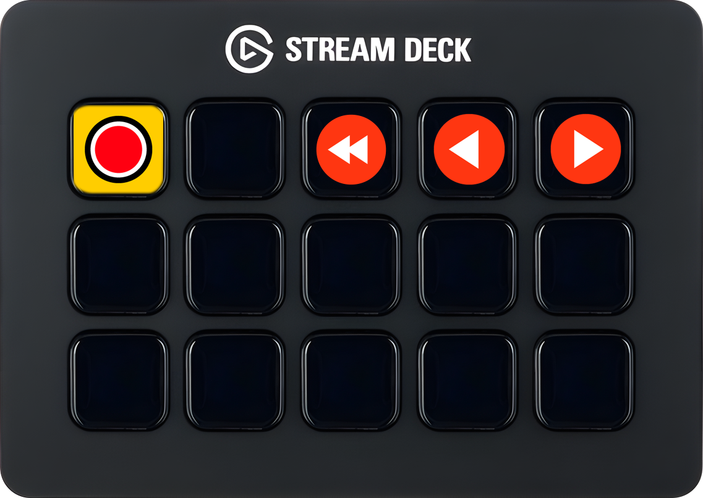

Log in als **User** om deze settings aan te passen.

De software van de Stream Deck is zo geconfigureerd dat deze de juiste knoppen weergeeft voor zowel de DIY Studio App als PowerPoint.

Hiervoor is een eigen Stream Deck-plugin ontwikkeld, die te vinden is in de DIY Studio Software Package.

- Kopieer de map `nl.uu.diy-studio.sdPlugin` naar:

  ```
  C:\Users\User\AppData\Roaming\Elgato\StreamDeck\Plugins
  ```

- Herstart de Stream Deck-software. In het rechterpaneel staat nu onderaan een categorie `DIY Studio` met de volgende acties die aan een knop kunnen worden toegewezen:
  - Record-stop toggle
  - Back to first slide
  - Previous slide
  - Next slide
  - Language toggle → **deze niet gebruiken**

Plaats deze als volgt door ze vanuit het rechterpaneel naar de knoppen te slepen:



- Ga naar *Settings* (tandwiel-icoon) en vink het volgende uit:
  - `Automatically check for updates`
  - `Open automatically at login`
