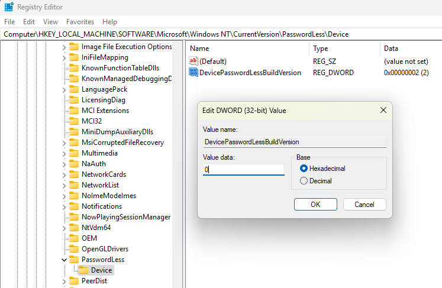
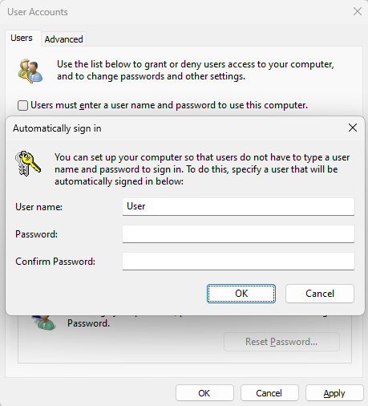
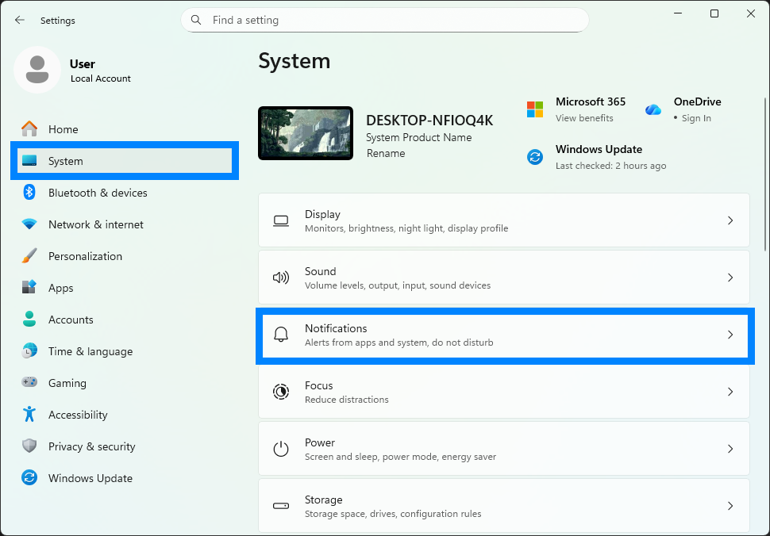
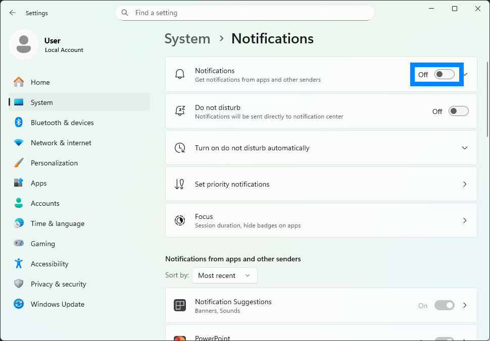
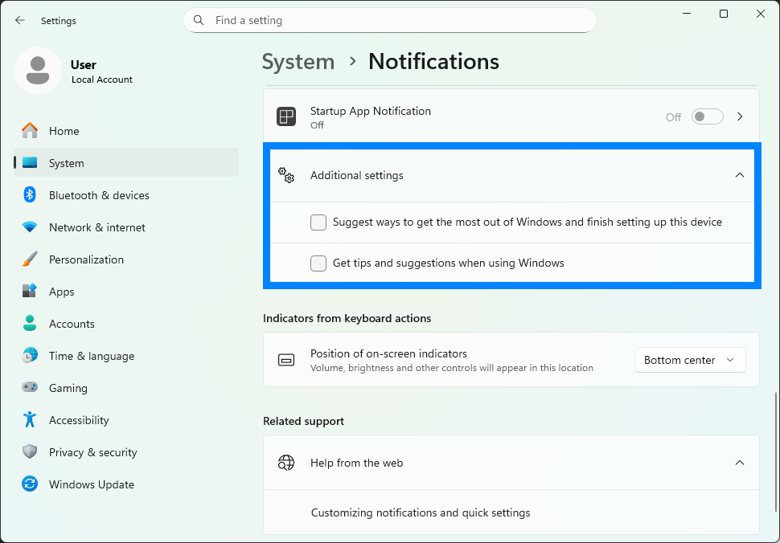

De PC draait Windows 11 Professional. Zorg voor een schone installatie zonder UU-software. Dit kan door een reset via het netwerk uit te voeren. Druk tijdens het opstarten, zodra het HP-logo in beeld komt, herhaaldelijk op `F11` om een network recovery uit te voeren.

## Stap 1: gebruikersaccounts instellen

Windows dient twee gebruikersaccounts te hebben:

- Een lokaal administrator-account met de naam **Setup**, beveiligd met een wachtwoord.
- Een lokaal gebruikersaccount met de naam **User**, beveiligd met een wachtwoord. Voeg deze na installatie toe via `Settings > Accounts > Other Users > Add account`.

Zorg ervoor dat de PC tijdens het configureren van Windows geen internetverbinding heeft. Wanneer er gevraagd wordt om toch met een netwerk te verbinden, druk dan `Shift+F10` en voer uit:

```
OOBE\BYPASSNRO
```

Let op: dit bevat de letter **O**, niet het getal **0**. Na het herstarten kun je kiezen voor `I don't have internet`.

> Update: Microsoft heeft deze workaround inmiddels geblokkeerd. Gebruik, als er geen andere lokale-accountoptie meer beschikbaar is, tijdelijk het Microsoft-account van Arthur Verbeek en maak achteraf alsnog een lokaal account aan. Verwijder daarna het Microsoft-account.

Kies verder tijdens de installatie overal voor `"No"` en bij diagnostics voor `Required Only`.

## Stap 2: instellen dat User standaard wordt ingelogd

- Log in als **Setup**.
- Start de registry editor via `Win + R` en voer uit:

  ```
  regedit
  ```

- Wijzig vervolgens deze register-entry van `2` naar `0`:

  ```
  HKEY_LOCAL_MACHINE\SOFTWARE\Microsoft\Windows NT\CurrentVersion\PasswordLess\Device\DevicePasswordLessBuildVersion
  ```



- Herstart de computer en log opnieuw in als **Setup**.
- Open via `Win + R`:

  ```
  netplwiz
  ```

- Vink `Users must enter a user name and password to use this computer` uit.
- Klik op `OK`, vul als user `User` in, geef het gekozen wachtwoord op en druk op Enter.

Als dit niet mogelijk is, dan dient Windows Hello te worden uitgeschakeld.



## Stap 3: system settings

- In `Settings > System > Display > Multiple displays`:
  - `Remember window locations based on monitor connection` moet **aangevinkt** zijn.
  - `Minimize windows when a monitor is disconnected` moet **uitgevinkt** zijn.
  - Kies het scherm linksonder (scherm 2) en vink `Make this my main display` aan.


- In `Settings > System > Power > Screen, sleep & hibernate timeouts`:
  - `Turn off screen after: Never`
  - `Make my device sleep after: Never`
  - `Make my device hibernate after: Never`

- In `Settings > Privacy & security > Notifications` zet je `Let apps access your notifications` uit.
- *(Waarschijnlijk niet nodig)* In `Apps > Startup` zet je `HP Notifications` en `myHP System Tray` op `Off`.

## Stap 4: netwerkinstellingen voor Ultimatte

Ga naar `Settings > Network & internet > Ethernet` en kies de onderste poort (`Ethernet 2`, dus **niet** `soliscom.uu.nl`). Ga daarna naar `IP assignment > Edit > Manual > IPv4` en gebruik:

```
IP address: 192.168.10.221
Subnet mask: 255.255.255.0
```

Dit IP-adres mag niet hetzelfde zijn als dat van de Ultimatte. Zet Wi‑Fi, indien aanwezig, op `Off`.

## Stap 5: juiste microfooninput selecteren

Log in als **User**, ga naar `Settings > System > Sound` en kies:
- Input
  - Choose a device for speaking or recording
    - Line In
    - Blackmagic DeckLink Studio 4K Audio
  - Volume: 100


Let op dat er geen schuine streep door het microfoon-icoon staat bij *Volume*. Dan is de microfoon namelijk gemute.

## Stap 6: "Let's finish setting up your device" uitschakelen

1. Ga naar `Settings > Notifications` en zet *Notifications* volledig op `Off`.





2. Ga naar *Additional settings* en vink alle opties uit.


