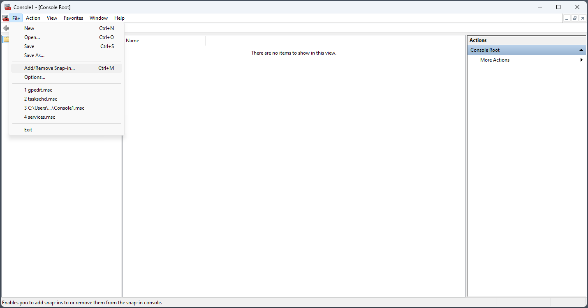
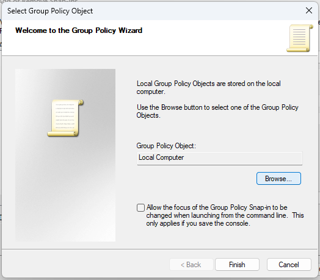
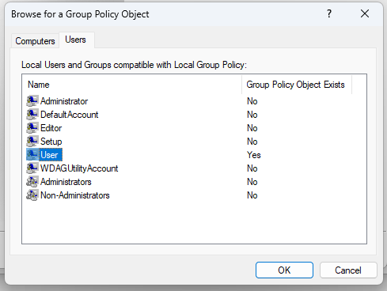
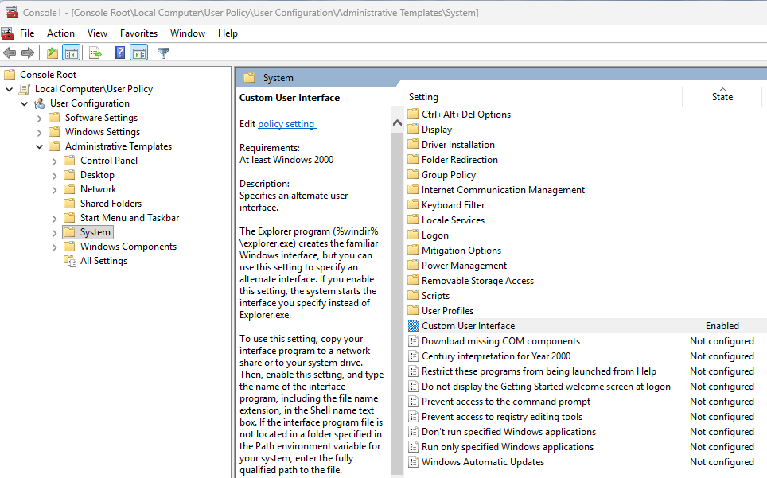
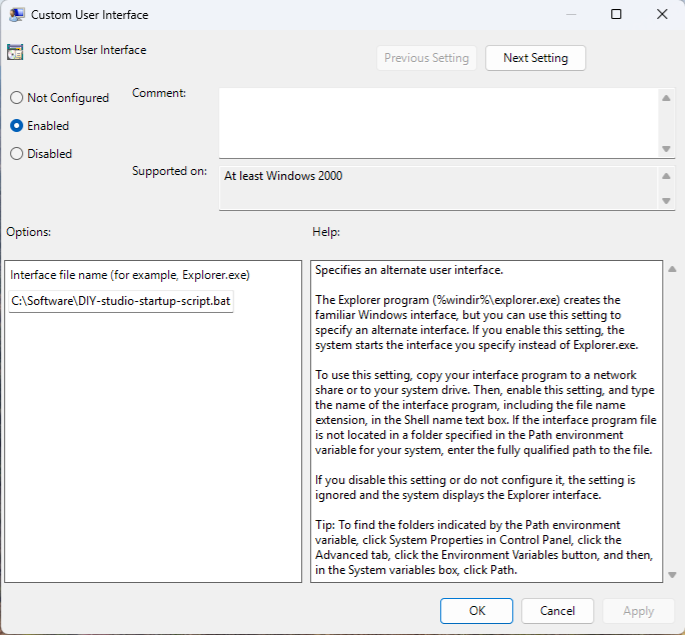

## Local Group Policy voor User

Door het instellen van een Local Group Policy zorg je ervoor dat de gebruiker van de studio geen taakbalk, explorer, startmenu en andere Windows-onderdelen te zien krijgt, en niet zomaar andere apps kan starten.

1. Log in als gebruiker **Setup** (administrator).
2. Druk `Win + R`, typ `mmc` en bevestig met Enter.
3. Klik op `File > Add / Remove Snap-in`.



4. Kies in het linkerpaneel `Group Policy Object Editor` en klik op `Add`.


5. Klik in het volgende scherm op `Browse`.



6. Ga naar het tabblad *Users*.
7. Selecteer de gebruiker **User**.



8. Klik op `OK`, `Finish` en daarna opnieuw op `OK`.

Verander daarna de volgende settings onder:

```
Console Root > Local Computer\User Policy\User Configuration\Administrative Templates\
```



- `System > Custom User Interface` → **Enabled**  
  Vul onder *Options > Interface file name* in:

  ```
  C:\Software\DIY-studio-startup-script.bat
  ```

- `System > Ctrl + Alt + Del Options > Remove Change Password` → **Enabled**
- `System > Ctrl + Alt + Del Options > Remove Task Manager` → **Enabled**
- `System > Removable Storage Access > All Removable Storage classes: Deny all access` → **Enabled**
- `Windows Components > AutoPlay Policies > Turn off Autoplay` → **Enabled**

Kies `File > Save` en sla de policy op.

Via `Ctrl + Alt + Del` kan er altijd nog worden uitgelogd, zodat er eventueel kan worden ingelogd met het **Setup**-account.


