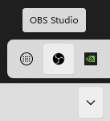

# 2.2 Problemen met de DIY Studio App

## De DIY Studio App start niet op

Is er een command prompt te zien? Zo ja: is hier een foutmelding op te zien? Noteer deze of maak een foto. Probeer daarna de PC opnieuw op te starten.

Start de app nog steeds niet? Check dan nogmaals of er in dit venster een foutmelding te zien is en noteer of fotografeer deze. Geef deze foutmelding door aan Content & Digital.

## De DIY Studio App geeft een foutmelding

### 101 — Websocketverbinding verbroken

**EN:** Websocket connection closed

Deze foutmelding is op dit moment niet in gebruik.

### 102 — Geen internetverbinding

**EN:** No internet connection

Controleer of de zwarte UTP-kabel in de onderste Ethernetpoort op de PC zit, en zo ja, of het andere uiteinde onder de vloer is aangesloten. Zo ja, dan zal internet eruit liggen (tenzij de UTP-kabel zelf stuk is) en kan er niet worden opgenomen.

### 103 — Applicatievenster niet gestart

**EN:** Application window not created

Deze foutmelding is op dit moment niet in gebruik.

### 104 — Kan niet verbinden met Ultimatte

**EN:** Can't connect to Ultimatte

Controleer of de rode UTP-kabel in de bovenste Ethernetpoort op de PC zit, en zo ja, of het andere uiteinde is aangesloten op de Blackmagic Ultimatte.

### 105 — Kan niet verbinden met Stream Deck

**EN:** Can't connect to Ultimatte

Controleer of de Stream Deck goed is aangesloten via USB (deze kabel gaat naar de Dell monitor). Controleer dan of de juiste knoppen te zien zijn op de Stream Deck (zie hieronder, bij **Het bedieningspaneel werkt niet**). Is dat niet het geval, dan is ofwel de Stream Deck software niet gestart, of de juiste plugin is niet geladen. Neem contact op met Content & Digital als dit het geval is.

### 106 — Versleutelen van bestand mislukt

**EN:** File encryption failed

Dit moet grondiger worden uitgezocht door Content & Digital. De PC kan voor nu worden uitgezet (en zal anders automatisch afsluiten na 30 minuten). Meld het probleem bij C&D.

### 107 — We konden geen geluid detecteren

**EN:** We could not detect any sound

Controleer de microfoonkabels. Log dan in als administrator en controleer in de geluidsinstellingen in Windows of de microfooninput aan staat.

### 108 — De applicatie is gecrasht

**EN:** The application has crashed

In principe kan de applicatie verder gewoon gebruikt worden. Check of alles naar behoren werkt en meld de crash bij Content & Digital zodat het verder onderzocht kan worden.

### 201 — OBS: kan de juiste scene collectie niet laden

**EN:** OBS: can't load the correct Scene Collection

Dit betekent dat de juiste Scene Collection voor OBS niet is geïnstalleerd.

1. Download de nieuwste DIY Studio Software Package.
2. Login als administrator.
3. Start OBS op.
4. Kies in het topmenu **Scene Collection > Import** en importeer de scene collection uit `Settings\OBS`.

### 202 — OBS: kan het juiste profiel niet laden

**EN:** OBS: can't load the correct profile

Dit betekent dat het juiste profiel voor OBS niet is geïnstalleerd.

1. Download de nieuwste DIY Studio Software Package.
2. Login als administrator.
3. Start OBS op.
4. Kies in het topmenu **Profile > Import** en importeer het profiel uit `Settings\OBS`.

### 203 — OBS: verbinding verbroken

**EN:** OBS: connection closed

Dit betekent dat de verbinding met OBS werd verbroken. Deze zal automatisch opnieuw worden opgestart, waarna de foutmelding zou moeten verdwijnen. Gebeurt dit niet? Druk dan op `F11` en wacht een moment. OBS zal worden afgesloten indien deze nog draait, en daarna weer worden opgestart.

### 204 — OBS: kan opnamemap niet instellen

**EN:** OBS: can't set record folder

Log in als administrator en controleer of de mappen `D:\Recordings\good`, `D:\Recordings\bad` en `D:\Recordings\temp` bestaan. Zo niet, maak deze dan aan en herstart de PC.

### 205 — OBS: opname niet gestart

**EN:** OBS: recording not started

Druk op `F11` en wacht een moment. OBS zal worden afgesloten indien deze nog draait, en daarna weer worden opgestart. Probeer opnieuw om op te nemen. Lukt het nog steeds niet, log dan in als administrator, start OBS en probeer handmatig een opname te starten om te kijken wat er misgaat.

### 206 — OBS: opname niet gestopt

**EN:** OBS: recording not stopped

Hier is geen eenvoudige oplossing voor. Om de opname te proberen te redden kun je proberen om uit te loggen, en vervolgens in te loggen als administrator. Check of de video in `D:\Recordings\temp` staat en upload deze met SURFfilesender. Herstart dan de PC. Blijft het probleem zich voordoen, neem dan contact op met Content & Digital.

### 207 — OBS: veranderen van scene niet gelukt

**EN:** OBS: failed to switch scene

Login als administrator en start OBS. Deze start op in het system tray van Windows. Klik rechts in de taakbalk op het pijltje naar boven en klik op het icoon van OBS.

Controleer of in de linkerkolom (**Scenes**) de volgende scenes aanwezig zijn:

- `Record-StaticBG`
- `Record-PP`
- `Record-Outro`
- `Program-DeskHeight`
- `Ultimatte-BG-Photo1`
- `Ultimatte-BG-Photo2`
- `Ultimatte-BG-Photo3`
- `Ultimatte-BG-Photo4`
- `Ultimatte-BG-Yellow`
- `Ultimatte-BG-Cream`
- `Ultimatte-BG-Blue`
- `Ultimatte-BG-Green`
- `NoPreview`

Zo ja, herstart de PC en probeer het opnieuw. Zijn deze scenes er niet, installeer dan de Scene Collection opnieuw. Blijft het probleem zich voordoen, neem dan contact op met Content & Digital.

### 208 — Kan geen verbinding maken met OBS

**EN:** Unable to connect to OBS

Zie **203 — Connection closed**.

### 209 — OBS: de opname is onverwachts gestopt

**EN:** OBS: the recording stopped unexpectedly

Druk op `F11` en wacht een moment. OBS zal, indien deze nog draait, worden afgesloten en daarna weer worden opgestart. Probeer opnieuw om op te nemen. Gebeurt hetzelfde opnieuw, start dan de PC opnieuw op.

### 301 — Niet voldoende opslagruimte beschikbaar

**EN:** Not enough disk space available

De SSD waarop wordt opgenomen zit (te) vol. Login als administrator en controleer de map `D:\Recordings\backups`. Leeg deze om schijfruimte te maken.

### 302 — MKV-bestand niet gevonden

**EN:** MKV file not found

Deze foutmelding is op dit moment niet in gebruik.

### 303 — Remux gefaald

**EN:** Remuxing failed

Deze foutmelding is op dit moment niet in gebruik.

Check of de command prompt een melding geeft waar meer informatie in staat. Maak een foto hiervan en neem contact op met Content & Digital. De opname kan nog worden teruggehaald door in te loggen als administrator en deze terug te zoeken in `D:\Recordings\temp`. Upload de file met SURFfilesender.

### 304 — Kan map niet openen

**EN:** Can't open folder

Dit suggereert dat er iets mis is met een van de twee SSD’s in de PC. Herstart de PC om te kijken of het probleem blijft bestaan.

### 305 — Kan geen map aanmaken

**EN:** Can't create folder

Zie **304**.

### 306 — De video kon niet worden verplaatst naar de bestemming

**EN:** Video couldn't be moved to its destination

Log in als administrator en controleer of de mappen `D:\Recordings\good`, `D:\Recordings\bad` en `D:\Recordings\temp` bestaan. Zo niet, maak deze dan aan en herstart de PC.

### 307 — Bestand kon niet worden gekopieerd

**EN:** File copy failed

Log in als administrator en controleer of in de map `C:\Software\Mediaproducties-DIY-Studio-App\assets\html` de volgende bestanden staan:

- `pause-button.svg`
- `play-button.svg`
- `videoplayer.html`

Zo niet, dan is er iets mis met de GitHub-repository. Neem contact op met Content & Digital.

Staan deze bestanden er wel, kopieer ze dan handmatig naar `D:\Recordings`.

### 401 — OneDrive: er ging iets mis met inloggen

**EN:** OneDrive: something went wrong when logging in

Er kon niet worden ingelogd in OneDrive. Controleer of de internetverbinding werkt en probeer het nogmaals.

### 402 — OneDrive: kan geen uploadsessie aanmaken

**EN:** OneDrive: can't create upload session

Het lukt niet om een uploadsessie te starten om de opgenomen video naar OneDrive te uploaden. Controleer de internetverbinding. Werkt het nog steeds niet? Log dan in als administrator en verstuur de opnames in `D:\Recordings\good` via SURFfilesender.

### 403 — Je hebt niet genoeg ruimte vrij in je OneDrive

**EN:** You don't have enough free space in your OneDrive

De OneDrive van de ingelogde gebruiker zit (te) vol. Er dient eerst voldoende ruimte te worden vrijgemaakt voordat er video's kunnen worden geüpload.

### 404 — Je bent niet ingelogd in OneDrive

**EN:** You are not logged in to OneDrive

De gebruiker is niet (meer) ingelogd in OneDrive. Ga naar het tabblad **Inloggen** en log in. Geeft deze aan dat er reeds is ingelogd, probeer dan uit te loggen en opnieuw in te loggen.

### 405 — Fout tijdens het downloaden van de PowerPointpresentatie

**EN:** Error while downloading PowerPoint presentation

Log in als administrator en controleer of `C:\` voldoende ruimte heeft. Werkt het nog steeds niet, probeer dan in de app uit te loggen en opnieuw in OneDrive in te loggen.

### 406 — Uploaden van video naar OneDrive is mislukt

**EN:** Upload of video to OneDrive failed

Controleer of de gebruiker nog steeds voldoende vrije ruimte heeft in diens OneDrive. Controleer de internetverbinding. Werkt het nog steeds niet? Log dan in als administrator en verstuur de opnames in `D:\Recordings\good` via SURFfilesender.

### 407 — We hebben geen toestemming verkregen om uw OneDrive te gebruiken

**EN:** Failed to obtain permission to use your OneDrive

Log uit in de applicatie en probeer opnieuw in te loggen. De gebruiker moet toestaan dat de DIY Studio App toegang krijgt tot diens OneDrive. Lukt dit niet meer? Laat de gebruiker op een ander apparaat inloggen op `https://myapplications.microsoft.com/`, zoek de DIY Studio App op bij **My Apps** en geef toestemming.

### 408 — Er kon geen data worden opgehaald uit OneDrive

**EN:** Failed to obtain data from OneDrive

Log uit in de applicatie en probeer opnieuw in te loggen. Herstart de PC als het nog steeds niet werkt.

### 501 — PowerPoint kon niet geopend worden

**EN:** Unable to open PowerPoint

Herstart de PC en kijk of het nu wel werkt. Zo niet, log dan in als administrator, start PowerPoint handmatig en controleer of PowerPoint correct start en geactiveerd is met het standaardaccount van Arthur Verbeek.

### 502 — De PowerPointpresentatie kon niet geopend worden

**EN:** Unable to open PowerPoint presentation

Start de PC opnieuw op en probeer het opnieuw.
