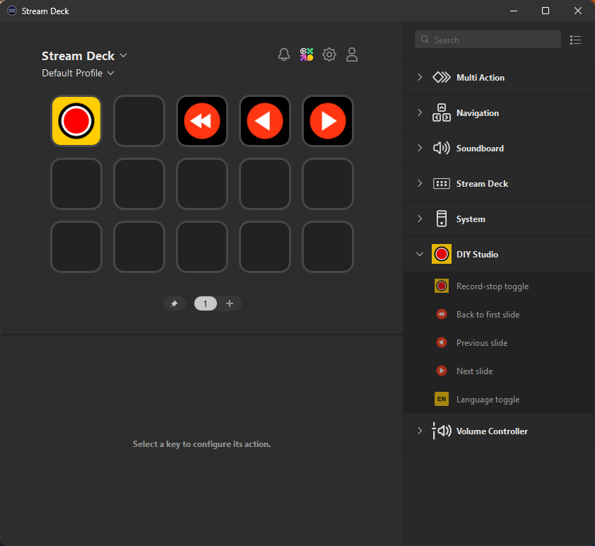

# 2.4 Overige hardwareproblemen

## De microfoon werkt niet

- Check of er wel geluid in de vocal processor komt door te praten en te kijken of de rode lampjes uitslaan.
- Zo niet, dan is er wellicht iets met de XLR-kabel waarmee de microfoon met de vocal processor is verbonden, of met de microfoon zelf.
- Controleer of de camera geluid binnenkrijgt, bijvoorbeeld door een koptelefoon aan te sluiten.
- Log in als administrator, start OBS en bekijk of de audiometers daar uitslaan.
- Controleer en vervang eventueel de kabels.

## De camera doet het niet

- Brandt de witte LED aan de voorkant niet? Controleer dan de stroomaansluiting en probeer de camera handmatig aan te zetten door de aan-uitknop links van de lens gedurende een seconde in te drukken.
- Brandt de witte LED aan de voorkant wel? Controleer dan of de SDI-kabels van de camera naar de Ultimatte goed zijn aangesloten.

De camera dient te zijn aangesloten via:

1. een kabel van type `micro-BNC (male) -> BNC (female)`
2. vervolgens een kabel van type `BNC (male) -> BNC (male)` op de Ultimatte op de `CAMERA FG`-input

Ontkoppel de kabels en sluit ze opnieuw aan, of vervang deze.

## Het bedieningspaneel werkt niet
Het paneel hoort er als volgt uit te zien:

- Is er niets zichtbaar, check dan of de USB-kabel goed is aangesloten en of de Stream Deck software gestart is.
- Zijn er andere iconen zichtbaar, dan moeten de juiste knoppen ingesteld worden in de Stream Deck software.
- Sluit de DIY Studio App met `Alt+F4`.
- Open de Stream Deck software (deze zou geminimaliseerd zichtbaar moeten zijn op het linkerscherm).

- Sleep de juiste knoppen op de juiste plekken.
- Is rechts de DIY Studio plugin niet te zien? Installeer deze dan (zie de installatiehandleiding).
- Ziet het paneel er normaal uit, maar werken de knoppen toch niet? Controleer dan de command prompt op fouten. Maak een foto, stuur deze naar Content & Digital en herstart de PC.

## De computer gaat niet uit bij het afsluiten

In dat geval worden er nog video's geüpload, of worden er Windows-updates geïnstalleerd. De computer zal daarna automatisch worden afgesloten. Zo niet, dan zal deze na 60 minuten alsnog worden afgesloten.

Sluit de PC nog steeds niet af? Houd de aan/uitknop dan 8 seconden ingedrukt om deze handmatig uit te zetten.
